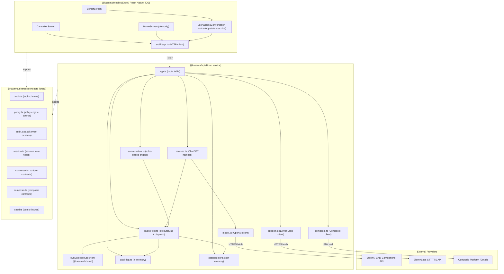
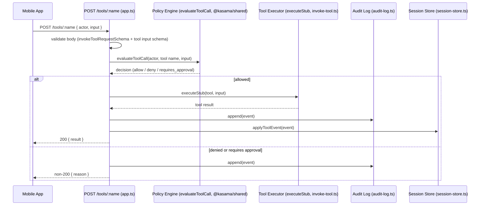
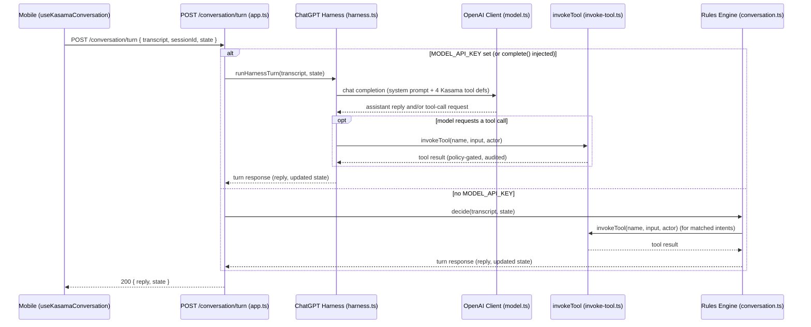

# Architecture Analysis — Kasama

## System Overview

Kasama is a small **pnpm/Turborepo monorepo** with three packages that form a classic client/service/shared-contracts shape:

- `@kasama/shared` (`packages/shared`) — a dependency-free (aside from `zod`) contracts library: Zod schemas and types for tools, policy, audit events, session views, conversation/voice-loop payloads, Composio contracts, and demo seed data. It is consumed as raw TypeScript source (no build/emit step) by both apps.
- `@kasama/api` (`apps/api`) — a Hono HTTP service (Node, run via `tsx`) that owns all business logic: tool policy evaluation, tool execution (currently stubbed), audit logging, session projection, the two conversation-turn engines, and integrations with three external providers (OpenAI, ElevenLabs, Composio).
- `@kasama/mobile` (`apps/mobile`) — an Expo/React Native (iOS-only) client that is a thin presentation + voice-loop-orchestration layer over the API; it holds no business logic of its own.

Full package responsibilities, sub-components, and dependency counts are catalogued once in `component-inventory.md`; this document focuses on how those components fit together and interact.

## Architectural Style

**Modular monolith service + thin client, contracts-first monorepo.** Evidence:

- Single deployable API process (`apps/api`) — not a set of independently deployable services. There is one Hono app (`apps/api/src/app.ts`) with all routes registered in one place; no service mesh, no inter-service network calls, no per-endpoint deployment boundary.
- The "microservice-shaped" separation that *does* exist is a **contract boundary, not a deployment boundary**: `@kasama/shared` centralizes every cross-boundary type/schema so the API and the mobile client can't drift on payload shape, per the repo's own stated convention (`AGENTS.md`).
- No API gateway, no message broker, no queue — synchronous HTTP request/response only (`hono/cors` wide open for LAN-only demo use).
- State is **in-process** (`Map`/array structures in `apps/api/src/audit-log.ts` and `session-store.ts`), not externalized to a database or cache — consistent with a monolith-at-demo-scale, not a distributed system.
- The one place the system reaches for an external "service" pattern is provider integration (OpenAI, ElevenLabs, Composio) via outbound `fetch`/SDK calls — this is integration, not internal service decomposition.

This is an appropriate style for the project's current maturity (see `business-overview.md` → Project Maturity); the improvement opportunities below note what would need to change if the system needed to scale past a single process.

## Component Relationships

## Data Flow

1. **Voice input → transcript**: the senior speaks in `SeniorScreen`; `useKasamaConversation` captures audio and posts it to `POST /speech/transcribe` (ElevenLabs Scribe STT) to get a text transcript.
2. **Transcript → conversation turn**: the mobile client posts the transcript to `POST /conversation/turn`. The API routes this to one of two engines (see Interaction Diagrams below): the ChatGPT harness (`harness.ts`, when `MODEL_API_KEY`/an injected `complete` dependency is present) or the rules-based engine (`conversation.ts`, otherwise).
3. **Tool calls → policy → execution → audit/session**: whichever engine decides a tool call is needed, it calls back into the single `invokeTool` pipeline (`invoke-tool.ts`), which validates the request body against `@kasama/shared` Zod schemas, evaluates it against the policy engine (`evaluateToolCall`), executes it (`executeStub`, currently stubbed for all four tools), appends an audit event, and updates the in-memory session projection.
4. **Reply → speech output**: the conversation-turn response (reply text plus any tool results) flows back to the mobile client, which posts the reply text to `POST /speech/speak` (ElevenLabs TTS) and plays the resulting audio.
5. **Oversight views**: independent of the voice loop, `GET /audit` and `GET /sessions/:sessionId` expose the accumulated audit trail and session projection — the read paths a caretaker-facing surface would consume.
6. **Email (side path)**: `POST /composio/connect` / `POST /composio/execute` talk to the Composio SDK directly for Gmail actions, **outside** the `invokeTool` → policy → audit pipeline described above (see Improvement Opportunities and `code-quality-assessment.md`).

All payload shapes for these flows are defined once in `@kasama/shared` and enumerated in `api-documentation.md`; this section describes the flow, not the wire format.

## Interaction Diagrams

The two most representative business transactions — a policy-gated tool call, and a full conversation turn that triggers one — are shown below.

### Transaction: Tool Invocation (e.g. `book_ride`, `notify_caretaker`)

### Transaction: Conversation Turn (voice loop, model-driven path)

Both diagrams converge on the same `invokeTool` pipeline shown in the first diagram — this is the single policy/audit choke point referenced throughout `business-overview.md` and flagged as important context for any new tool work.

## Key Design Decisions

- **Contracts-first shared package with no build step**: `@kasama/shared` is consumed as raw TypeScript source (`exports: "./src/index.ts"`), eliminating a build/publish step for the most frequently-touched cross-boundary code, at the cost of requiring both consumers to share the same TS toolchain/version.
- **Single tool-invocation choke point**: all four tools flow through one `invokeTool` function that always applies policy evaluation and audit logging, so no tool can bypass the safety model by construction (enforced by convention/code review, not a compiler-level guarantee) — see `AGENTS.md`'s explicit instruction to extend this path for any new tool.
- **Model-cannot-self-approve policy rule**: a deliberate architectural safety decision (`packages/shared/src/policy.ts`) that constrains the ChatGPT harness specifically, not just actors in general — addressing the specific risk of an LLM approving its own high-risk tool request.
- **Two parallel conversation engines** (rules-based and ChatGPT-harness-based), selected by API key presence rather than a single unified engine — a pragmatic decision for demo robustness (works without a model key) that introduces duplicated logic (see Improvement Opportunities and `code-quality-assessment.md`).
- **In-memory-only state**: explicit, documented choice for demo scope rather than an oversight — keeps the system simple and dependency-free (no database to provision) at the cost of durability across restarts.
- **Composio integration bypasses the policy/audit pipeline**: an explicitly flagged, known architectural gap (`ARCHITECTURE.md` itself calls this out) rather than a silent one.

## Improvement Opportunities

- **Unify or formally reconcile the two conversation engines** (`conversation.ts` vs `harness.ts`) — they currently duplicate ride-proposal, appointment-formatting, and yes/no-detection logic with a regex case-sensitivity mismatch; a shared intent/response-formatting layer would remove the drift risk.
- **Route Composio actions through the existing policy/audit pipeline** before any caretaker-facing email action ships for real, per the project's own documented intent.
- **Introduce a persistence layer** (even an embedded one) for the audit log and session store if the system needs to survive process restarts or run more than one API instance — the current design is single-process by construction.
- **Add CI and a linter** — no automated gate currently enforces `pnpm typecheck && pnpm test` on push; see `code-quality-assessment.md` for the full picture.
- **Tighten CORS** (`origin: "*"`) before any deployment beyond a local/LAN demo.
