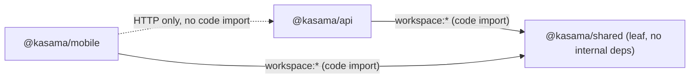

# Dependencies — Kasama

Library versions are catalogued in `technology-stack.md`; this document covers the *relationships* — internal cross-package dependencies, external service dependencies, and the build-order graph they imply.

## Internal Cross-Package Dependencies

- `@kasama/api` → `@kasama/shared` (`workspace:*`) — imports Tool Contracts, Policy Engine, Audit Event Schema, Session View Types, Invoke Contracts, Conversation Contracts, Composio Contracts. See `component-inventory.md` for exactly which API module uses which shared module.
- `@kasama/mobile` → `@kasama/shared` (`workspace:*`) — imports shared request/response types for the API Client.
- `@kasama/mobile` → `@kasama/api` — **HTTP only**, not a code-level dependency; the mobile app never imports API server code.
- `@kasama/shared` → **no internal dependencies** — leaf package; only external dependency is `zod`.

**Build order implication**: Turborepo's task graph declares `build`/`typecheck`/`test` with `dependsOn: ["^build"|"^typecheck"|"^test"]`, so `@kasama/shared` is always built/typechecked/tested before the two apps that consume it. `dev`/`start`/`ios` tasks are marked `cache: false, persistent: true` (long-running dev servers, correctly excluded from caching).

## External Service Dependencies

| Service | Consumed by | Purpose | Auth | Failure mode when unconfigured |
|---|---|---|---|---|
| OpenAI Chat Completions | `apps/api/src/model.ts` → Harness | Conversation-turn generation + tool-calling (ChatGPT harness path) | `MODEL_API_KEY` env var | Falls back to Rules-based Conversation Engine (`conversation.ts`) — not an error, a designed fallback |
| ElevenLabs Speech-to-Text | `apps/api/src/speech.ts` → `POST /speech/transcribe` | Voice transcription | `ELEVENLABS_API_KEY` env var | `501 Not Implemented` |
| ElevenLabs Text-to-Speech | `apps/api/src/speech.ts` → `POST /speech/speak` | Spoken reply synthesis | `ELEVENLABS_API_KEY` env var | `501 Not Implemented` |
| Composio Platform (Gmail toolkit) | `apps/api/src/composio.ts` → `POST /composio/*` | Gmail connect/execute (currently `GMAIL_GET_PROFILE` only) | `COMPOSIO_API_KEY` env var | `501 Not Implemented` |
| Browserbase | **None yet** — env vars declared (`BROWSERBASE_API_KEY`/`BROWSERBASE_PROJECT_ID` in `.env.example` and `envKeys` in `@kasama/shared`) but no calling code exists anywhere in the scanned source | Reserved/planned for future live-Uber ride booking (tracked as issues `#14`/`#7` per `ARCHITECTURE.md`) | n/a (unimplemented) | n/a |

All four external providers communicate over plain HTTPS `fetch` (OpenAI, ElevenLabs) or their own SDK (`@composio/core` for Composio) — no message broker, no webhook receiver, no polling job. Every provider call originates from `apps/api`; `apps/mobile` never calls an external provider directly.

## Dependency-Related Risks (cross-referenced from `code-quality-assessment.md`)

- **Composio bypasses the internal dependency graph's safety layer**: `apps/api/src/composio.ts` does not depend on the Policy Engine or Audit Log (see `component-inventory.md` → Composio Integration), unlike every other external-facing path in the system, which all converge on the Tool Invocation Router. This is a structural asymmetry in the dependency graph, not just a behavioral gap.
- **`shamefully-hoist=true`** in root `.npmrc` — flattens `node_modules` (closer to npm/yarn hoisting behavior); signals at least one dependency (likely an Expo/React Native tool) that isn't fully pnpm-strict-compatible. Minor structural workaround, not a bug.
- **Env-var loading duplicated** across two independent hand-rolled parsers (`apps/api/src/load-env.ts`, `apps/mobile/scripts/start-expo.cjs`) rather than a single shared utility or a library like `dotenv` — low risk given both are small and stable, but a maintenance duplication if either needs to change.

## What Is Not a Dependency

- No database, ORM, or cache library anywhere in the stack (state is in-process only — see `technology-stack.md` → Data / Persistence).
- No message queue, event bus, or service-mesh dependency.
- No CI/CD platform dependency (no `.github/` workflows exist).
