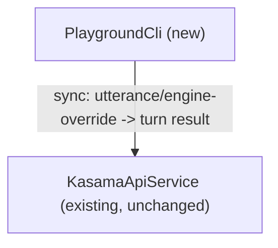

# Component Catalogue — Text/HTTP Agent Playground

This is a small, additive change: exactly one new logical building block,
confirmed with the human (domain-design-questions.md Q1-Q2). It owns no
entities and contains no business logic of its own — the same shape as
`@kasama/mobile`'s existing relationship to `@kasama/api` (thin client over
HTTP, all decisions made server-side). No existing components change.

## Part A — Machine-Readable Catalogue

```yaml
components:
  - name: PlaygroundCli
    summary: CLI entry point that sends a single text utterance through the existing conversation/tool pipeline and prints the result to the terminal, without the mobile UI.
    behaviour: >
      Parses CLI arguments (a positional utterance string, an optional --engine
      rules|harness override). Sends the utterance to the existing
      POST /conversation/turn endpoint using the seeded Maria/senior demo actor
      as the default identity, optionally overriding the engine selection.
      Formats the response for terminal output: echoes what was sent, then
      prints appointment/ride/pending-approval/retry-handoff content as
      applicable. Exits 0 for any completed turn (including pending-approval
      and retry-handoff outcomes); exits non-zero only for a genuine
      operational failure (API unreachable, malformed argument). Owns no
      business logic — every decision (policy evaluation, tool execution,
      audit logging) happens server-side in the already-existing pipeline;
      this component only formats input and output.
    responsibilities:
      - CLI argument parsing (utterance, --engine)
      - Sending the HTTP request to the existing conversation-turn endpoint
      - Formatting the turn response as human-readable terminal output
      - Mapping operational failures (unreachable API, bad arguments) to a non-zero exit code
    depends_on:
      - component: KasamaApiService
        interaction: Sends the utterance and receives the conversation-turn result (appointment/ride/pending-approval/retry-handoff content)
        style: sync
    dependents: []
    external_dependencies: []
    entities: []

  - name: KasamaApiService
    summary: Existing, unchanged Hono HTTP service (apps/api) that owns the conversation/tool/policy/audit pipeline. Not new work — declared here only so PlaygroundCli's dependency edge is real and traceable, per component-inventory.md's "@kasama/api" entry.
    behaviour: >
      Unchanged by this issue. Already implements conversation-turn handling
      (both the rules-based and ChatGPT-harness engines), tool invocation,
      policy evaluation, and audit logging, as catalogued in
      aidlc/spaces/default/codekb/sasehack26/component-inventory.md and
      architecture.md. Listed here at the same summary level as PlaygroundCli
      only to make the depends_on edge well-formed; its internals are out of
      scope for this domain-design pass and are not re-decomposed here.
    responsibilities:
      - Already-existing conversation/tool/policy/audit pipeline (unchanged)
    depends_on: []
    dependents:
      - component: PlaygroundCli
        interaction: Receives the utterance/engine-override request and returns the turn result
    external_dependencies: []
    entities: []
```

Well-formedness check: two component names, both unique, no self-dependency;
`depends_on`/`dependents` are symmetric (`PlaygroundCli` depends_on
`KasamaApiService`, `KasamaApiService` lists `PlaygroundCli` as a dependent);
no entities to own or reference; no `external_dependencies` needed now that
the existing API is modeled as a real (existing) component rather than
infrastructure; the two-node graph is trivially acyclic.

`KasamaApiService` is declared here only to make `PlaygroundCli`'s
`depends_on` edge well-formed per the stage's own rule ("every
`component:`/`owned_by` named anywhere is a declared component") — it is an
**existing** component this stage does not re-decompose or change, not new
work. See `decisions.md` ADR-002 for the full rationale: an earlier draft
modeled this call as an `external_dependency`, which would have misled
Units Generation into treating the existing API as outside the system's
component graph.

## Part B — Human-Readable View

### Component Diagram



### Component Summary

| Component | Purpose | Depends On | Dependents | Entities Owned |
|---|---|---|---|---|
| PlaygroundCli | CLI wrapper around the existing conversation/tool pipeline for UI-free testing | KasamaApiService | — | none |
| KasamaApiService | Existing conversation/tool/policy/audit pipeline (unchanged; declared here only for a well-formed dependency edge) | — | PlaygroundCli | none (out of scope to re-decompose here) |

### Entity Ownership

No entities are introduced or owned by either component. `PlaygroundCli`
formats data already defined by the existing system's contracts
(`packages/shared/src` — tool results, policy decisions, conversation-turn
responses) without introducing new domain concepts; `KasamaApiService`'s
existing entities are out of scope for this pass (see
`component-inventory.md` for its actual internal structure).

### External Dependencies

None. An earlier draft modeled the call to the existing API as an
`external_dependency`; on reflection this was a miscategorization —
`@kasama/api` is an existing logical component, not infrastructure — so it
is now a real `depends_on` edge to `KasamaApiService` instead (see
Component Diagram/Summary above, and `decisions.md` ADR-002).

### Rationale

| Component | Why a separate building block |
|---|---|
| PlaygroundCli | Distinct lifecycle (a one-shot CLI process that starts, sends one request, prints output, and exits — unlike the long-running API server or the mobile app's persistent session) and distinct concern (developer-facing test/demo tooling, explicitly scoped apart from any end-user-facing surface per issue #13's own "Out of scope" line). Confirmed with the human (Q1) rather than folding this into an existing component or treating it as a mere script with no component identity, since it has its own clear boundary, responsibility, and reason to exist separately. |
| KasamaApiService | Not a new building block — declared only because the stage's well-formedness rule requires every `depends_on` target to be a declared component. Its actual boundary/rationale was set when it was originally built, not by this pass. |

No component-boundary trade-off block is included: only one decomposition
was viable here (a single thin wrapper component), confirmed directly with
the human at Q1 rather than presented as a multi-option trade-off.
